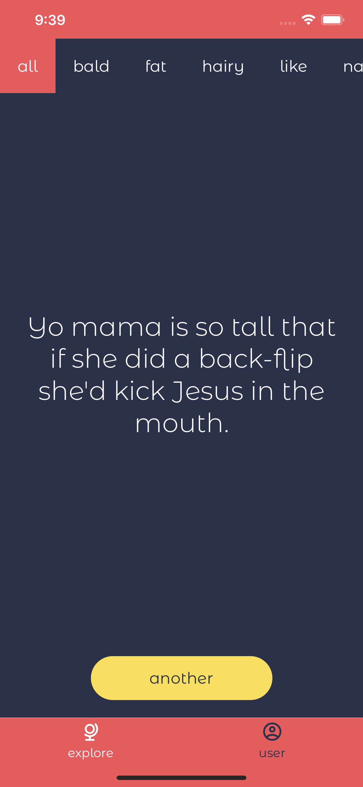
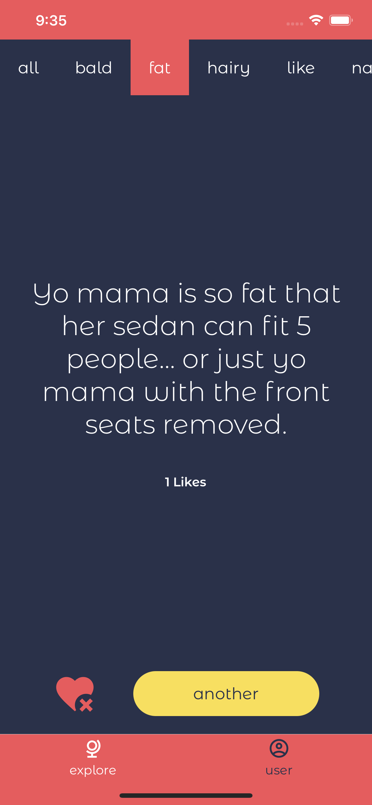
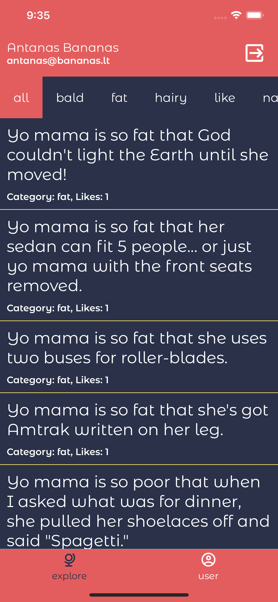
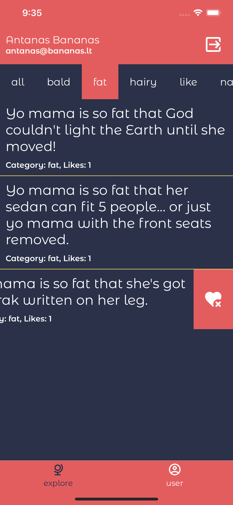
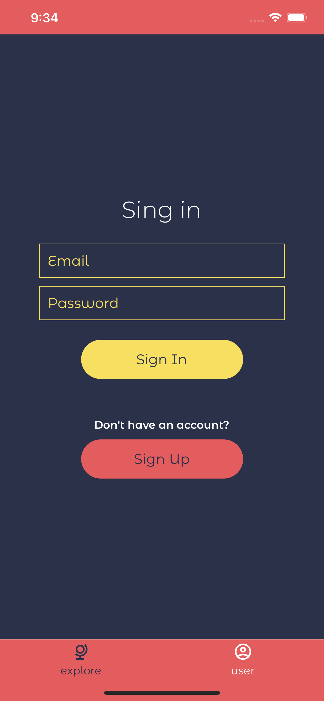
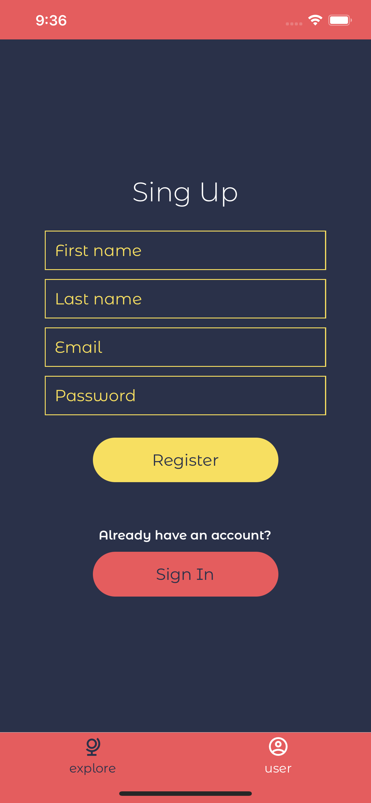

<p align="center">
  
</p>

A collection of _yo mama_ jokes.

> This is a personal React Native learning project. All jokes are from [this repository](https://github.com/joshbuchea/yo-mama).

Data is hosted on [Cloud Firestore](https://console.firebase.google.com/u/0/project/yo-mama-22978/firestore/data~2Fjokes~2Fbald). Application is using Google Authentication.

The app allows user authentication and signup. Once logged-in, user can _like_ jokes and they will appear on their dashboard.

Feed provides over 800 jokes divided into multiple categories.

## Demo

Android users can run the app on the phone from [expo.io](https://expo.io/@rendertom/projects/yo-mama). Just follow the instructions on the website to get started. Alternatively, download the `yo-mama <...>.apk` file from the [releases](https://github.com/rendertom/yo-mama/releases) section and install it on your phone manually.

For iOS users - currently, there's no way to run the app on a physical phone. There is, however, a way to run the app on your Mac in Simulator app. To do so, download `yo-mama-<...>-simulator.tar.gz` file from the [releases](https://github.com/rendertom/yo-mama/releases) section and install it on the Simulator app (you'll need Xcode application for that). Alternatively, you can build and run the project locally and serve it with the expo client.

## Build/develop locally

Download the repository and do the following:

```bash
# install expo-cli globally
npm install --global expo-cli

# install Watchman (macOS only)
brew update
brew install watchman

# navigate to the project folder
cd path/to/yo-mama

# start expo server
expo start
```

- To run the iOS simulator, you'll need [Xcode](https://developer.apple.com/xcode/).
- To run the android emulator, you'll need [Android Studio](https://developer.android.com/studio)

## Screenshots

</img>
</img>
</img>
</img>
</img>
</img>
